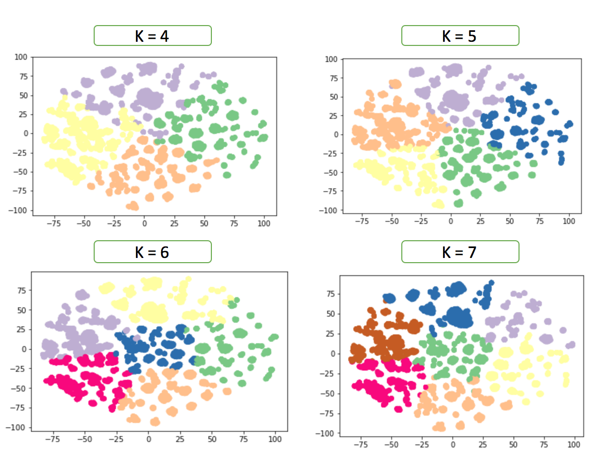

## User Segmentation Models
---
### Contents

1. [Introduction](#introduction)
2. [Overview](#overview)
4. [Conclusion](#conclusions)
5. [Acknowledgments](#acknowledgments)

### Introduction
We present a diverse set of clustering algorithms to obtain the most optimal user segmentation based on a binary user-traits data provided by Adobe Audience Manager team. We divide the problem into two parts, namely, optimizing the number of clusters and optimizing the clustering method and solve each one independently. We use a modified version of the Calinski-Harabasz Index to evaluate the performance of our methods. The given dataset is extremely sparse, and hence we want to use a denser lower dimension representation of the data for clustering. We design three uniquely distinct models to perform the clustering. We offer a naive Bisecting K-means model for simple but fast clustering needs. Our Auto-encoder based model captures the non-linear structure in the data extremely well, whereas the Matrix Factorization based clustering effectively handles missing entries in the dataset. Based on our evaluation metric values for different numbers of clusters, we conclude that given dataset has around five underlying user segments. We believe, with enough training, our models can be tuned to cluster any general sparse binary dataset.

### Overview
We choose the following three candidate algorithms for clustering:
* **Naive K-means**: This is our baseline model. It is the simplest and the fastest way to obtain the user segments.
* **Autoencoder**: We aim to capture the non-linear relationships among the traits using an Autoencoder. The lower dimension output of the encoded layer from the network would then be used to obtain the user segments.
* **Matrix Factorization**: We use matrix factorization to both reduce the dimensions, as well as to capture any missing data patterns in the dataset. The latent vectors from user space are subsequently used for clustering.

Trait 800 in the dataset is omnipresent and skews the clustering around it. Therefore, we create models with and without the trait.

### Performance
Here are some visualizations of the user segments obtained using our clustering models.

#### Autoencoder Based Clustering
The image on the left shows a T-SNE visualization of our autoencoder based segmentation. The image on the right compares Naive K-means against auencoder based clustering methods.

| | |
|---|---|
|  |  |

#### Matrix Factorization Based Clustering
These images depict the user segmentation based on Matrix Factorization with trait 800 (on the left) and without trait 800 (on the right).

| | |
|---|---|
|  |  |

#### Comparisons

As seen in Figure below, the matrix factorization (ALS + K-means) model seems to perform the best, followed by the autoencoder model and the factorization machine model. On the other hand, FM model is the fastest to train while the autoencoder model takes forever to train on the entire dataset.

| |
|---|
|  |

### Conclusions
We present a diverse set of models to solve the sparse binary feature data clustering problem. Naive K-means is a simple but fast way to obtain the clusters. Autoencoder + K-means captures the non-linear structure in the data very well, and once trained on enough data can be used to draw inferences on a large dataset. Matrix Factorization + K-means is the only approach, we tried, which handles the missing data aspect of the problem.

Based on our evaluation metric values on clustering for different K's, we can conclude that the ideal number of clusters in the dataset is around 5.

### Acknowledgments
We would like to thank Prof. Eleni Drinea for giving us the opportunity to work on this project. We would also like to thank Charles and Handong for their valuable inputs.
